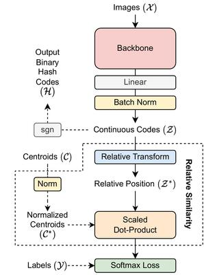

# RelaHash

[View on IEEE Xplore](https://ieeexplore.ieee.org/document/10076458) | [PDF](https://ieeexplore.ieee.org/stamp/stamp.jsp?tp=&arnumber=10076458)

### Official PyTorch implementation of IEEE Access 2023 paper: "RelaHash: Deep Hashing with Relative Position"

## Description

Deep hashing has been widely used as a solution to encoding binary hash code for approximating nearest neighbor problem. It has been showing superior performance in terms of its ability to index high-level features by learning compact binary code. Many recent state-of-the-art deep hashing methods often use multiple loss terms at once, thus introducing optimization difficulty and may result in sub-optimal hash codes. OrthoHash was proposed to replace those losses with just a single loss function.  However, the quantization error minimization problem in OrthoHash is still not addressed effectively. In this paper, we take one step further - propose a single-loss model that can effectively minimize the quantization error without explicit loss terms. Specifically, we introduce a new way to measure the similarity between the relaxed codes with centroids, called relative similarity. The relative similarity is the similarity between the relative position representation of continuous codes and the normalized centroids. The resulting model outperforms many state-of-the-art deep hashing models on popular benchmark datasets.



The mAP of image retrieval are shown in the following table: _(using AlexNet as backbone)_

| Dataset \ bits       	| 16    	| 32    	| 64    	| 128   	|
|----------------------	|-------	|-------	|-------	|-------	|
| CIFAR10 (mAP@all)    	| 0.820 	| 0.835 	| 0.852 	| 0.854 	|
| ImageNet100 (mAP@1K) 	| 0.632 	| 0.684 	| 0.713 	| 0.727 	|

## How to run

### Training

<a target="_blank" href="https://colab.research.google.com/github/thaiminhpv/RelaHash/blob/master/training_example_colab.ipynb">
  
</a>

```bash
python main.py --ds cifar10 --nbit 64 --device cuda:0 
```

You can run `python main.py --help` to see the full list of arguments.

You can also checkout the [example training notebook](./training_example_colab.ipynb) and run it on free Tesla T4 GPU provided by Google Colab.

### Dataset

We closely follow the dataset format of [HashNet](https://github.com/thuml/HashNet). You can follow the instructions as in [this link](https://github.com/swuxyj/DeepHash-pytorch) to download the datasets.

### Reference

If you find this repo useful, please consider citing:

```bibtex
@ARTICLE{RelaHash,
    author={Minh, Pham Vu Thai and Viet, Nguyen Dong Duc and Son, Ngo Tung and Anh, Bui Ngoc and Jaafar, Jafreezal},
    journal={IEEE Access}, 
    title={RelaHash: Deep Hashing With Relative Position}, 
    year={2023},
    volume={11},
    number={},
    pages={30094-30108},
    doi={10.1109/ACCESS.2023.3259104}
}
```
